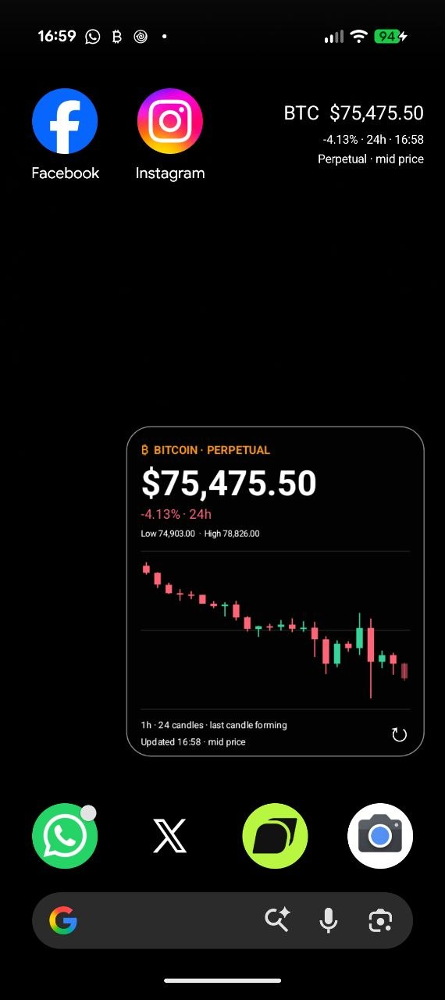
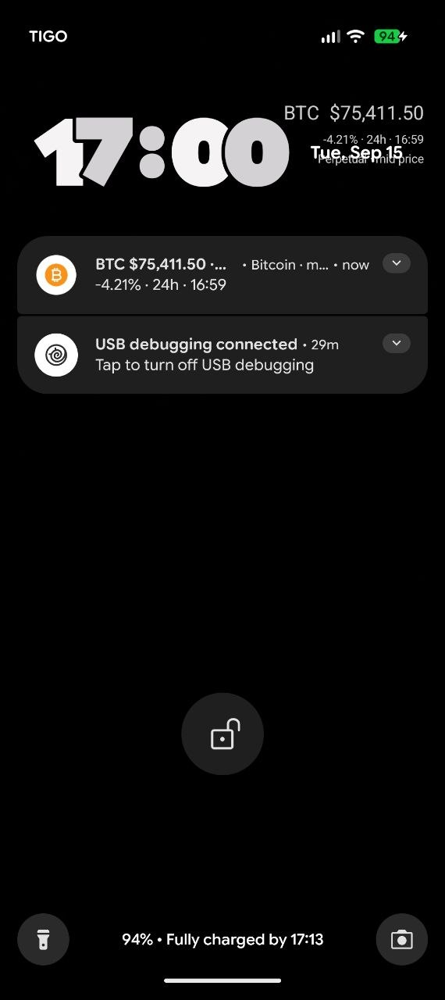
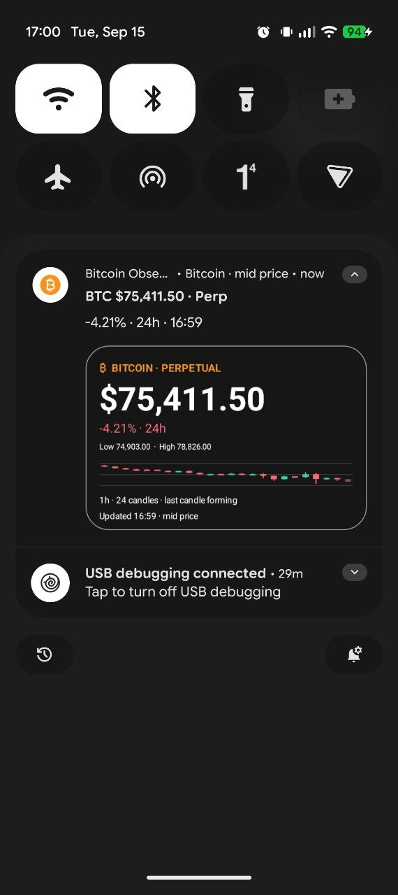

# Bitcoin Obsessed

[](https://github.com/juancarestre/bitcoin-obsessed-live-wallpaper/actions/workflows/ci-release.yml)
[](LICENSE)
[](docs/INSTALLING.md)

Bitcoin on your home screen. A free Android live wallpaper, transparent candlestick widget, and smart price alerts — no ads, subscriptions, or paid features.

**[Download the latest APK](https://github.com/juancarestre/bitcoin-obsessed-live-wallpaper/releases/latest)** · [Installation](docs/INSTALLING.md) · [Build from source](docs/DEVELOPMENT.md)

## See it in action

Real screenshots from an Android phone. Tap an image to view it at full size; the prices shown are historical examples.

<table>
  <tr>
    <th>Home screen</th>
    <th>Lock screen</th>
    <th>Expanded notification</th>
  </tr>
  <tr>
    <td align="center"><a href="docs/images/home-screen.png"></a></td>
    <td align="center"><a href="docs/images/lock-screen.png"></a></td>
    <td align="center"><a href="docs/images/expanded-notification.png"></a></td>
  </tr>
  <tr>
    <td><strong>Bitcoin at a glance.</strong> A small live price at the top and a transparent, resizable widget with 24 hourly candles.</td>
    <td><strong>Check the price while locked.</strong> The live wallpaper and compact price notification remain visible where supported by your device.</td>
    <td><strong>More detail without opening the app.</strong> Expand the price notification to see its 24-hour change, update time, and candlestick chart.</td>
  </tr>
</table>

## Features

- Your own wallpaper photo with a small, live Bitcoin price overlay.
- A transparent, resizable widget showing the last 24 hourly candlesticks.
- Price, 24-hour change, and a visible last-update time.
- An optional silent price notification.
- Free Google-connected RSI alerts using closed 1h candles.
- One active price target per device, with a one-time notification when an observed price crosses it.
- A simple English interface with a fixed dark/transparent appearance.

The wallpaper and widget work without an account. Google Sign-In links your devices for alerts; every verified Google account has the same free access.

### Market and update behavior

Prices come from a Bitcoin **perpetual market**, not a spot BTC/USD index. The displayed quote is a mid price, while candlesticks and RSI use market OHLC data.

Visible app/wallpaper updates run approximately once a minute. Android may delay background widget and price-notification updates. Server-side price alerts are checked approximately once a minute: a brief touch between checks can be missed. RSI alerts use closed candles and establish an initial baseline without replaying old signals.

## Install

1. Open [Releases](https://github.com/juancarestre/bitcoin-obsessed-live-wallpaper/releases).
2. Download the `.apk` asset, not the source-code archive.
3. Open it on Android 9 or newer and allow installation from your browser/file manager when prompted.
4. Choose your photo, set the live wallpaper, or add the widget.
5. Sign in with Google and save your alert settings if you want notifications.

Release APKs share a dedicated signing key, so future releases update in place. **Development/debug APKs have a different signature** and require a one-time uninstall before switching to the public release. Read the [upgrade instructions](docs/INSTALLING.md) first to preserve your original photo and note your settings.

## Monorepo

```text
app/          Native Android app (Kotlin, Views, Canvas)
backend/      Scheduled alerts and authenticated API (JavaScript, Workers, D1)
scripts/      Repository checks, signing helpers, and release tooling
docs/         Development, installation, backend, and release guides
.github/      CI, pull-request checks, and automatic signed APK releases
```

The root Gradle project builds Android. The backend has its own npm manifest and lockfile.

## Development

Requirements: JDK 17, Android SDK platform/build-tools 36, Node.js 22.22+, and Python 3.10+.

```bash
cp app/google-services.example.json app/google-services.json
./gradlew testDebugUnitTest lintDebug assembleDebug
npm --prefix backend ci
npm --prefix backend test
```

The example Firebase configuration is intentionally nonfunctional; it is sufficient for compilation and unit tests. Configure your own Firebase project and backend for a working local app. See [DEVELOPMENT.md](docs/DEVELOPMENT.md).

## Releases and contributions

`main` is protected: changes go through pull requests with passing repository-hygiene, backend, and Android checks. Every successful merge to `main` builds a signed APK and creates a GitHub Release with a SHA-256 checksum. No production credentials are available to pull-request builds.

See [CONTRIBUTING.md](CONTRIBUTING.md) and [RELEASING.md](docs/RELEASING.md). Backend deployments are deliberately separate from APK releases.

## Current scope

This is an early release focused on Bitcoin and one price target per device. Multi-asset support, multiple targets, account-deletion UI, and Google Play publication are not implemented. The backend is designed for an initial beta; large public deployments need additional quotas and delivery scaling.

Wallpaper photos stay on the device. The alert service stores account/device identifiers, notification tokens, alert preferences, and recent delivery records. Do not attach private photos, account details, or credentials to public issues.

## License

[MIT](LICENSE). Third-party dependencies retain their own licenses.
